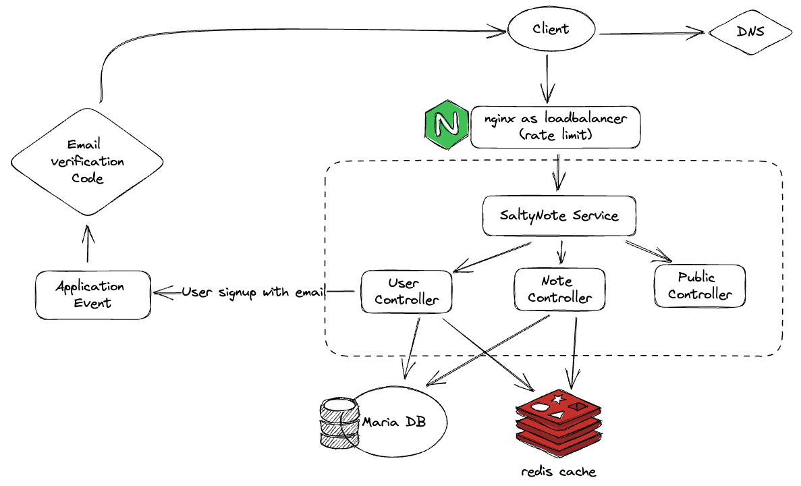
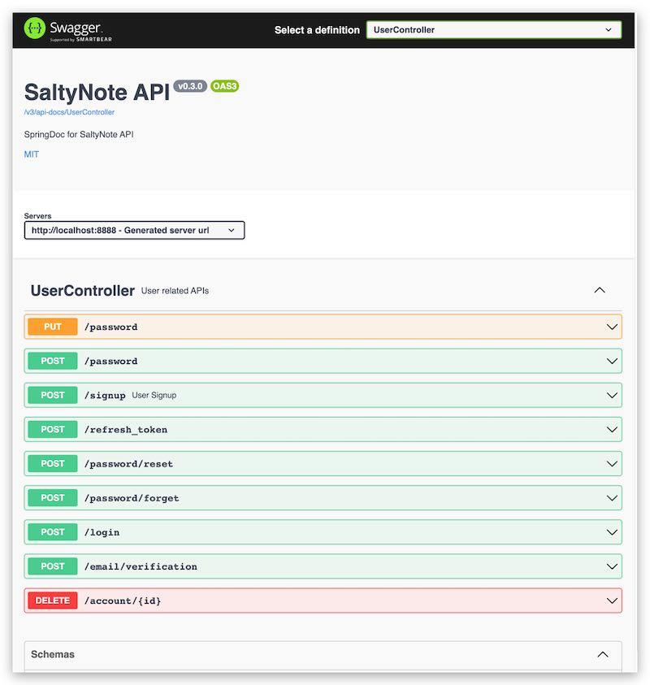

# SaltyNote Service

[](https://github.com/SaltyNote/saltynote-service/actions/workflows/maven.yml)
[](https://github.com/SaltyNote/saltynote-service/actions/workflows/report.yml)
[](https://github.com/SaltyNote/saltynote-service/actions/workflows/deploy-prod.yml)
[](https://www.codefactor.io/repository/github/saltynote/saltynote-service)
[](https://app.codacy.com/gh/SaltyNote/saltynote-service/dashboard?utm_source=gh&utm_medium=referral&utm_content=&utm_campaign=Badge_grade)
[](https://app.fossa.com/projects/git%2Bgithub.com%2FSaltyNote%2Fsaltynote-service?ref=badge_shield)


## Overview

This is the backend service for [saltynote](https://saltynote.com). It
uses [JWT](https://auth0.com/docs/tokens/json-web-tokens) for authentication(`access token` & `refresh token`). As high-level, this service provides
APIs for:

1. User (signup, login, token refresh, token cleanup, password reset, account delete)
2. Note (create, update, fetch and delete)



Unit Test Coverage report: https://saltynote.github.io/saltynote-service/jacoco/

## Try with Docker

Due to different storage engines, there are TWO docker-compose files, one for [mongo](./script/docker-compose-mongo.yml) and the other
for [mariadb](./script/docker-compose-mariadb.yml).
```bash
# For mariadb, please run:
docker compose -f docker-compose-mariadb.yml -p saltynote-service-mariadb up

# For mongodb, please run:
docker compose -f docker-compose-mongo.yml -p saltynote-service-mongo up
```

When it is ready, you can visit http://localhost:8888, it should response with the payload below.
```json
{
   "status": "OK",
   "message": "Welcome to SaltyNote!"
}
```


## Get Started

This is a standard spring boot project with Maven, so you can use generic maven command to run it. While the simplest &
quickest way is to run [`./start.sh`](./start.sh).

Swagger UI will be available at http://localhost:8888/swagger-ui.html (Screenshot for User APIs)


### Prerequisite

1. Java 17 (due to Spring Boot v3)
2. Docker (docker compose) for setting up development dependencies, e.g. database, redis, etc.
3. IDE ([Eclipse](https://www.eclipse.org/) or [Intellij](https://www.jetbrains.com/idea/))

### Configuration

1. The service relies on database to store `user` and `note` information. In development env, you can run `docker compose up`
   to start `mongo(storage)` and `redis(cache)` locally(*add `-d` if you want start it as “detached” mode*).
2. This service also need smtp service to send email(*Note: this is optional now, if not setup, the email payload will
   be logged([code](src/main/java/com/saltynote/service/event/EmailEventListener.java#L50-L55)).*).

## License

saltynote service is licensed under MIT - [LICENSE](./LICENSE)
