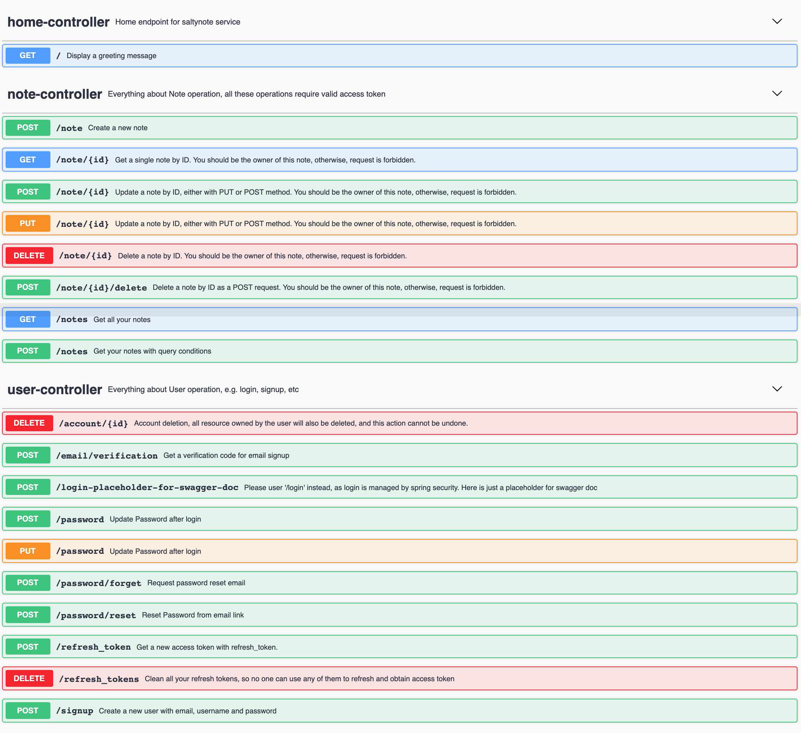

# SaltyNote Service

[Documentation](https://saltynote.github.io/saltynote-service/)

## Overview

This is the backend service for [saltynote](https://saltynote.com). It
uses [JWT](https://auth0.com/docs/tokens/json-web-tokens) for authentication. As high-level, this service provides APIs
for:

1. User (signup, login, token refresh, token cleanup, password reset)
2. Note (create, update, fetch and delete)

For more information about the endpoints, please refer the [swagger ui(*readonly*)](https://api.saltynote.com/swagger-ui/) for more details.

## Get Started

This is a standard spring boot project with Maven, so you can use generic maven command to run it. While the simplest &
quickest way is to run [`./start.sh`](./start.sh).

### Prerequisite

1. JDK 11
2. Docker (docker-compose) for development database
3. IDE ([Eclipse](https://www.eclipse.org/) or [Intellij](https://www.jetbrains.com/idea/))
4. Code format is using [google-java-format](https://github.com/google/google-java-format)

### Configuration

1. The service relies on database to store `user/note` information. In development env, you can run `docker-compose up`
   to start mariadb (*add `-d` if you want start it as “detached” mode*).
2. This service also need smtp service to send email(*Note: this is optional now, if not setup, the email payload will
   be logged.*). In development env, you can configure it with your gmail account. See more details
   here； https://git.io/JLP6q

## License

saltynote service is licensed under MIT - [LICENSE](./LICENSE)

