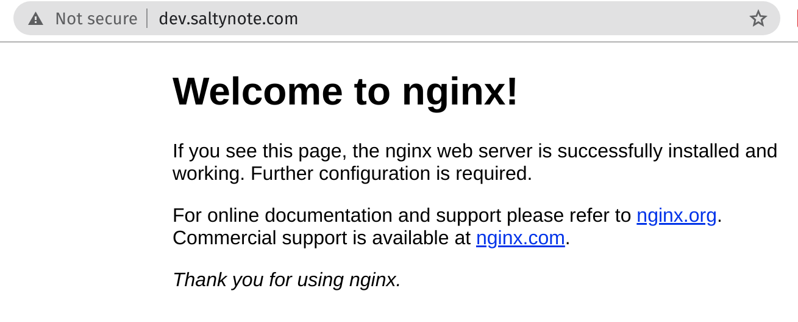
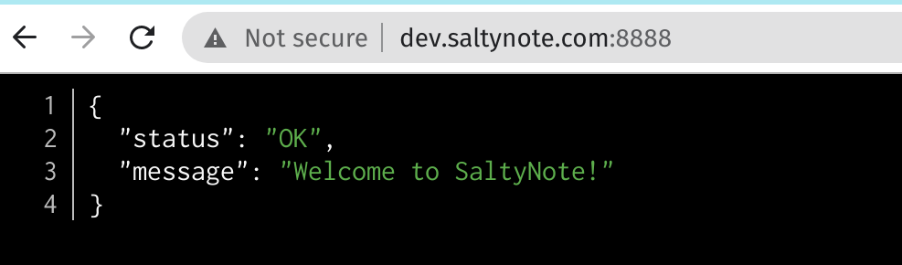
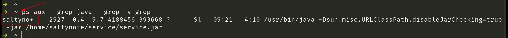
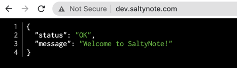
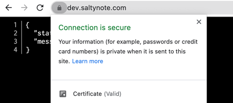

This is an opinionated memo that lists the steps to set up an Ubuntu server(20.04) for web service or website.

## 1. General Initialization

The step 1 is what I will do for all new servers, even for my personal Linux laptop.

### 1.1 Update Server first

```bash
# This step may take some time, just be patient
sudo apt update && sudo apt upgrade -y
```

When this step is done, you can restart your server. But usually, I will restart after I have everything installed.

### 1.2 Install Basic Tools

```bash
# Maybe most of them are already bundled with Ubuntu
sudo apt install git vim curl wget zsh htop
```

I really like `zsh`, and I will also enable [oh-my-zsh](https://ohmyz.sh/). But this is optional, even I highly
recommend it.

## 2. Setup for Web Server

### 2.1 Install Necessary Software

```bash
sudo apt install openjdk-11-jre mariadb-server nginx
```

#### Java

I install open Java 11 here, based on your own requirement, you can either install Java 8 or Java 14, whatever you want.
The reason why I just install JRE not JDK is because I will only need Java Runtime in this server, and I will never try
to compile or build any Java projects.

```bash
# Check whether java is installed correctly
root@dev:~# java -version
openjdk version "11.0.9.1" 2020-11-04
OpenJDK Runtime Environment (build 11.0.9.1+1-Ubuntu-0ubuntu1.20.04)
OpenJDK 64-Bit Server VM (build 11.0.9.1+1-Ubuntu-0ubuntu1.20.04, mixed mode, sharing)
```

#### MariaDB

It is almost the same as MySQL. Personally, I choose Mariadb these days. An important reason is that they have different
licenses.

* [MariaDB](https://mvnrepository.com/artifact/org.mariadb.jdbc/mariadb-java-client) is LGPL 2.1.
* [MySQL](https://mvnrepository.com/artifact/mysql/mysql-connector-java) is GPL 2.0, which is not compatible with MIT
  license.

If you take Open Source seriously, this is something that you should
care. [如何选择开源许可证](http://www.ruanyifeng.com/blog/2011/05/how_to_choose_free_software_licenses.html)

**Configure MariaDB**

```bash
sudo mysql_secure_installation
# Select "Yes" to the end
```

**Verify MariaDB**

```bash
# You should see similar output as below:
root@dev:~# mysql -u root -p
Enter password:
Welcome to the MariaDB monitor.  Commands end with ; or \g.
Your MariaDB connection id is 57
Server version: 10.3.25-MariaDB-0ubuntu0.20.04.1 Ubuntu 20.04

Copyright (c) 2000, 2018, Oracle, MariaDB Corporation Ab and others.

Type 'help;' or '\h' for help. Type '\c' to clear the current input statement.

MariaDB [(none)]>
```

#### NginX

As a reverse proxy, NginX is very helpful. Usually, I use it as a load balancer.

Simply open `http://your-server-ip`, you will see a welcome page:



## SaltyNote Server Setup & Configuration

### Database

#### 1. Create a new database, and a database user

Login database from terminal with `mysql -u root -p`, and execute follow command lines:

```sql
CREATE DATABASE saltynote;

-- Please update USER_NAME and A-STRONG-PASSWORD.
CREATE USER 'USER_NAME'@'localhost' IDENTIFIED BY 'A_STRONG_PASSWORD';
GRANT ALL PRIVILEGES ON saltynote.* TO 'USER_NAME'@'localhost' WITH GRANT OPTION;
```

Note: You can find more details about how to enable remote access
from [this post](https://hzhou.me/2014/04/21/mysql-enable-remote-access-and-create-a-new-user/). While here, I only
enable it with local access, as I for security reason, it is not required for current stage.

### Spring Boot Service

The [service](https://github.com/SaltyNote/saltynote-service) is implemented with Spring Boot. So it can be run with a
standalone jar file as a [Systemd](https://www.freedesktop.org/wiki/Software/systemd/) service. You can find more
official information
from [this link](https://docs.spring.io/spring-boot/docs/current/reference/html/deployment.html#deployment-systemd-service)
.

#### Create a new user

For security, I will create a specific user to run the
service. [This post](https://www.baeldung.com/spring-boot-app-as-a-service) will be very helpful for this step.

```bash
# Create a new user, and create its home dir
sudo useradd -m saltynote
# Update its password, so the new user can log in later
# Seems no need to log in with this user later.
# sudo passwd saltynote
```

#### Create Service Folder & Service Setup

```bash
mkdir -p /home/saltynote/service
chown saltynote:saltynote /home/saltynote/service
```

Upload the jar file to `/home/saltynote/service` folder, and create `application.properties` inside that folder, which
can be used to set some sensitive information. e.g. database connection info.

```bash
# Make saltynote is the owner of service.jar
chown saltynote:saltynote service.jar
# Only give owner read and execute permission
chmod 500 service.jar
```

##### Systemd Setup

Create `note.service` in `/etc/systemd/system` dir, and populate `note.service` as below:

```systemd
[Unit]
Description=SaltyNote Service
After=syslog.target

[Service]
User=saltynote
ExecStart=/home/saltynote/service/service.jar
SuccessExitStatus=143

[Install]
WantedBy=multi-user.target
```

We can enable this service to auto start when system restarts by:

```bash
systemctl enable note.service

# manually start it
systemctl start note.service

# check its status
systemctl status note.service
```

If everything goes well, the service should start now. Open http://YOUR-SERVER-IP:8888, you should see a welcome message
in JSON format.



```bash
# You can check that the service is running with saltynote user.
ps aux | grep java | grep -v grep
```



### NginX and HTTPS

Now, we can connect NginX with our service, which means we want `http://dev.saltynote.com` displays the same content
as `http://dev.saltynote.com:8888` instead of showing NginX welcome page.

#### 1. Add Upstream

Open `/etc/nginx/nginx.conf`, and add a new `upstream` inside `http` section. (I named it as `service`, while it can be
any name you want.)

```nginx
http {

    ## Other configurations
    
    upstream service {
        server 127.0.0.1:8888;
    }

    ## Other configurations
}
```

#### 2. Connect it in Site Conf

Open `/etc/nginx/sites-available/default`, and update the `server_name` and `location` sections.

**Note**: You must own the domain before you can add them to `server_name`.

```nginx
server {
    listen 80;
    listen [::]:80;
    
    # You can enable multiple domains below
    server_name dev.saltynote.com;

    location / {
        proxy_pass http://service;
    }
}
```

#### 3. Reload or restart NginX

```bash
service nginx restart
```



#### 4. Enable Https

So far, everything seems working now, while the browser still complains `Not Secure` in the url bar. It is time to
enable https for our service. It is free with [Let's Encrypt](https://letsencrypt.org/).

##### 4.1 Install [Certbot](https://certbot.eff.org/)

It should be easy to install certbot by following
the [instruction](https://certbot.eff.org/lets-encrypt/ubuntufocal-nginx).

```bash
# Since I use nginx, I will run this to enable https
sudo certbot --nginx
```



#### 5. Hide service from port 8888

We enable NginX with https for our service now, and we can hide the original service running in port `8888` from the
public. There are multiple solutions for this. e.g. [`iptables`](https://www.cyberciti.biz/faq/iptables-block-port/).

While I find [`UFW - Uncomplicated Firewall`](https://help.ubuntu.com/community/UFW) is more user-friendly, so I will
choose it here.

```bash
➜  ~ ufw status
# It is inactive by default
Status: inactive
➜  ~ ufw enable
# It is OK ot enable it, it will not disrupt your current SSH connection
Command may disrupt existing ssh connections. Proceed with operation (y|n)? y
Firewall is active and enabled on system startup
➜  ~ ufw allow 22   # For SSH
Rule added
Rule added (v6)
➜  ~ ufw allow 80   # For http 
Rule added
Rule added (v6)
➜  ~ ufw allow 443  # For https 
Rule added
Rule added (v6)
➜  ~ ufw status
Status: active

To                         Action      From
--                         ------      ----
22                         ALLOW       Anywhere
80                         ALLOW       Anywhere
443                        ALLOW       Anywhere
22 (v6)                    ALLOW       Anywhere (v6)
80 (v6)                    ALLOW       Anywhere (v6)
443 (v6)                   ALLOW       Anywhere (v6)
```

**Note**:For enhanced security, you can change default SSH port 22 to other number.

Now you will not be able to access the service with https://dev.saltynote.com.

## All Set Now! 🎉
